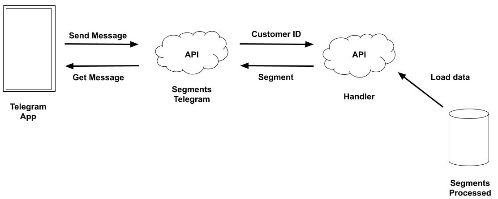

# Analyzing the Online Retail Customer Clustering kaggle dataset
## by Mário Damhur

## Dataset

Online retail is a transational data set which contains all the transactions occurring between 01/12/2010 and 09/12/2011 for a UK-based and registered non-store online retail. The company mainly sells unique all-occasion gifts. Many customers of the company are wholesalers. Here are the informations about the dataset:

 - **InvoiceNo**: Invoice number.
 - **StockCode**: Stock code.
 - **Description**: Description of the product.
 - **Quantity**: Quantity.
 - **InvoiceDate**: Date of the transaction.
 - **UnitPrice**: Price of unit product.
 - **CustomerID**: Customer ID.
 - **Country**: Which country happened the transaction.

# Diagram



# Browser Test

You can test the API with documentation on this link:
https://retail-rfm-segmentation.herokuapp.com/docs

- For unique ID you can receive the segment on the browser:
```
https://retail-rfm-segmentation.herokuapp.com/customers/{id}
```

**Example**:
```
https://retail-rfm-segmentation.herokuapp.com/customers/12347
```

Return: {'customer_id': 12347, 'segment': 'Master'}

- List of IDs:
```
https://retail-rfm-segmentation.herokuapp.com/customers/?customer_id={id}&customer_id={}
```

The symbol **?** means that parameters are expected. The symbol **&** means concatenate.

**Example**:
https://retail-rfm-segmentation.herokuapp.com/customers/?customer_id=12347&customer_id=12397

Return: {'customer_id': [12347, 12397], 'segment': ['Master', 'Business']}

# Terminal Test

- Unique ID Example:
```
curl -X GET "https://retail-rfm-segmentation.herokuapp.com/customers/12347" -H  "accept: application/json"
```

- List of IDs Example:
```
curl -X GET "https://retail-rfm-segmentation.herokuapp.com/customers/?customer_id=12347&customer_id=12397" -H  "accept: application/json"
```

# Request Python

- Unique ID Example:
```
data = 12347
url = 'https://retail-rfm-segmentation.herokuapp.com/customers/{}'.format(data)
r = requests.get(url)

print('Result: {}'.format(r.json()))
```
- List of IDs Example:
```
data = {'customer_id': [12347, 12397]}
url = 'https://retail-rfm-segmentation.herokuapp.com/customers/'
r = requests.get(url, params=data)

print('Result: {}'.format(r.json()))
```

# Telegram Bot

You can use the telegram bot like a usual contact. Copy and paste the contact [@customer_segmentation_bot] in a telegram chat to start a conversation.
For the Telegram only accept unique id. List od IDs will generate an error.


## Files

- **data**: Folder of the data.
- **segments-telegram-bot/**: Folder of the Telegram BOT API.
- **web_app/**: Folder of the API with Heroku.
- **Customer_Segmentation.ipynb**: The jupyter notebook with all the analysis process and segmentation.
- **Customer_Segmentation.html**: The HTML version of the jupyter above.
- **Storytelling_Segmentation_Apresentation.ipynb**: The jupyter notebook used to create the storytelling of the analysis and results.
- **Storytelling_Segmentation_Apresentation.slides.html**: The slide apresentation of the storytelling notebook.
- **output_toggle.tpl**: Template to hide the code in the slide deck.
- **README<span>.md</span>**: This file.
